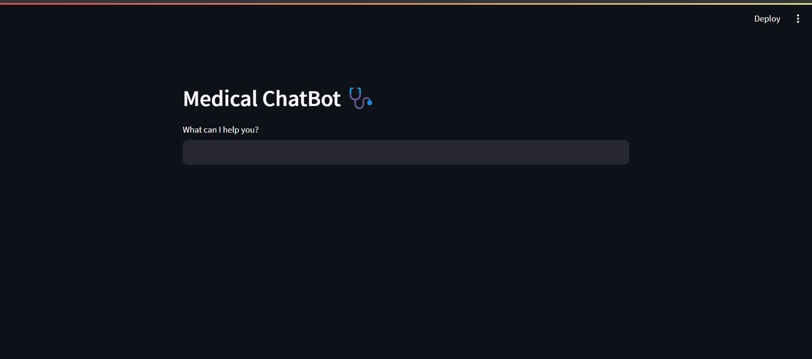
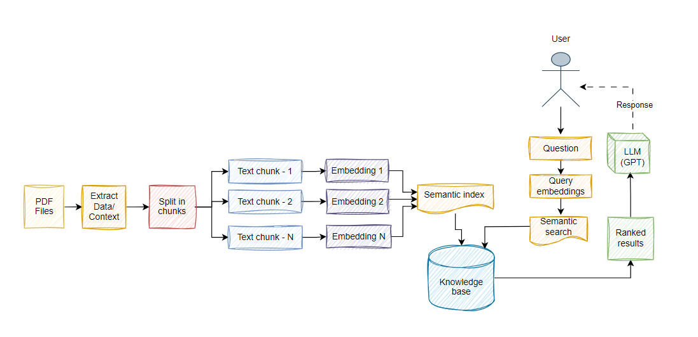
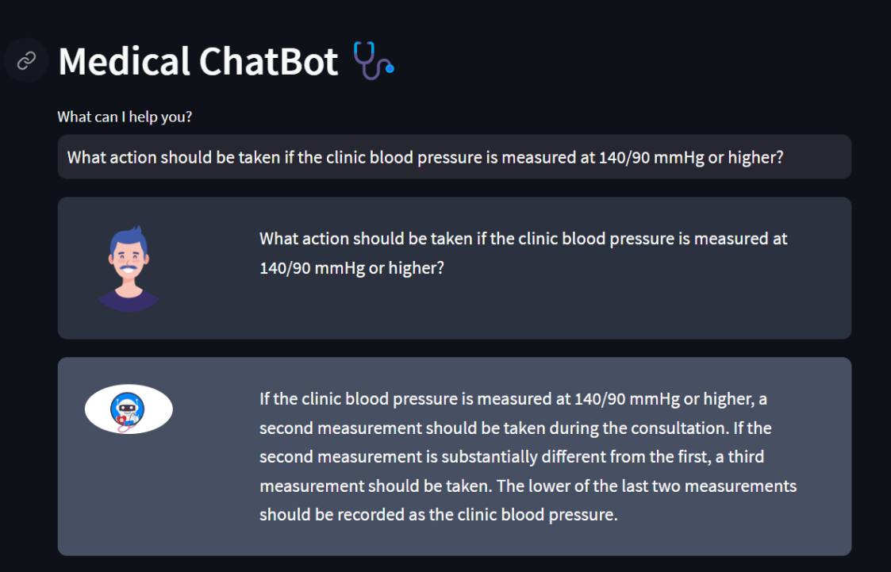

# Medical Chatbot 🤖🌡️
<h3> Welcome to Medical Chatbot ! </h3>



## Table of Contents

1. [Introduction](#1-introduction)
2. [How It Works](#2-how-it-works)
3. [Project Structure](#3-project-structure)
4. [Getting Started](#4-getting-started)
5. [Usage](#5-Usage)
6. [Performance Measurements](#6-performance-measurements)
7. [Contributing](#7-contributing)
8. [License](#8-license)


## Introduction 
This project leverages Natural Language Processing (NLP) techniques and Artificial Intelligence to provide accurate preliminary diagnoses based on user-input symptoms. The chatbot extracts information from medical PDFs and uses two advanced language models, ChatOpenAI and Flan-T5-SMALL, for effective communication.

## How It Works ⚙️




This chatbot operates by processing medical PDFs, extracting relevant information, and utilizing two advanced language models, ChatOpenAI and Flan-T5-SMALL, for generating responses. The LangChain framework facilitates efficient text processing, allowing real-time interaction with users.

### Steps for ChatBot Operation:

#### PDF Processing

The chatbot is designed to handle medical PDFs. The PDFs are processed to extract relevant information using an underlying mechanism.

#### 2. Language Models

Two advanced language models are employed in the chatbot:

- **ChatOpenAI:** This model is used for natural language understanding and generating responses based on user inputs.

- **Flan-T5-SMALL:** This model contributes to the chatbot's capabilities, enhancing the quality and diversity of responses.

#### 3. LangChain Framework

The text processing in the chatbot is powered by the LangChain framework. This framework ensures efficient handling of text data, enabling real-time interaction with users.


## Project Structure 📂
- `requirements.txt`: List of Python dependencies.
- `main.py`: Entry point for running the Streamlit application.
- `Performance_Measurements.py`: Module for measuring the performance of the chatbot.
- `data`: This folder contains medical dataset.
- `.gitignore`: Git configuration to ignore specific files and directories.
- `htmlTemplates.py`: HTML templates for the Streamlit application.
- `.env`: API Keys.
 
## Getting Started 🚦
1. Clone the repository to your local machine.
   ```bash
   git clone https://github.com/hussein-almansory/medical-chatbot.git

2. Install the required dependencies by running the following command:
    ```bash
    pip install -r requirements.txt

3. **IMPORTANT**: Obtain an API key from OpenAI (Recomended) or HuggingFace and add it to the `.env` file in the project directory


## Usage 🚀
To use the MedicalChat bot, follow these steps:
1. Ensure that you have installed the required dependencies.
2. Ensure that you have added the OpenAI API key to the **.env** file.
3. Run the `main.py` file using Streamlit. Execute the following command:
    ```bash
    streamlit run main.py
4. The application will launch in your default web browser, displaying the user interface.

5. Ask medical questions in natural language about medical diagnosis  using the chat interface.


### Now, you can ask medical question !



## Performance Measurements 📊

To measure the performance of the model using BLEU or Levenshtein distance, follow these steps:

1. Open `Performance_Measurements.py` and add the generated text to it.
2. Run the command `python Performance_Measurements.py` in your terminal.
3. Review the results, which will be displayed using the specified metrics.

 **Important**: Make sure to organize your generated and original texts appropriately within `Performance_Measurements.py` before running the script. The results will provide insights into the model's performance based on the BLEU and Levenshtein distance metrics.*


## Contributors
- Hussain Almansory
- Khalid Al Dhafeeri
- Abdulmalik Fagi
- Sari Ghatani
- Bassem Al Shehri
- Abdullah Al Talaq

## License
The Medical Chatbot is released under the MIT License.

